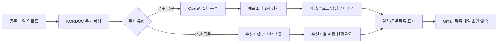
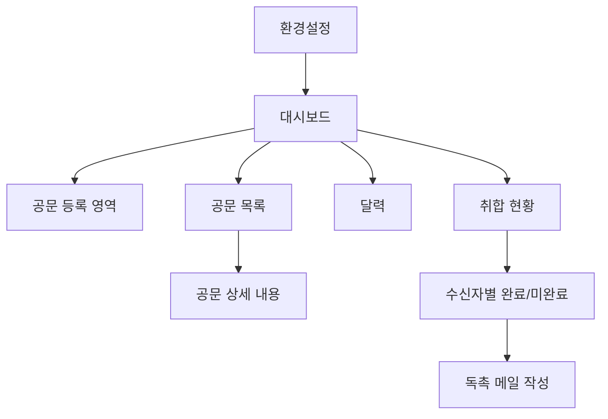
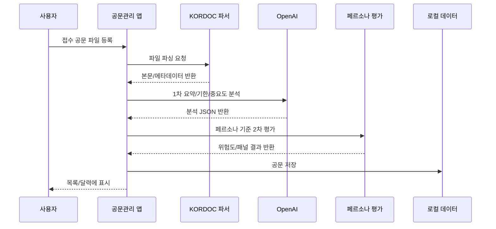
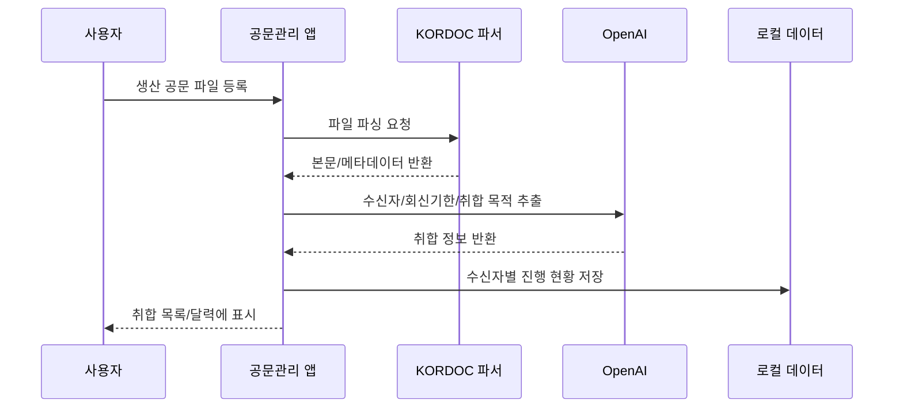
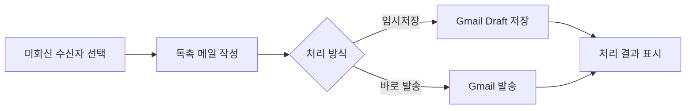
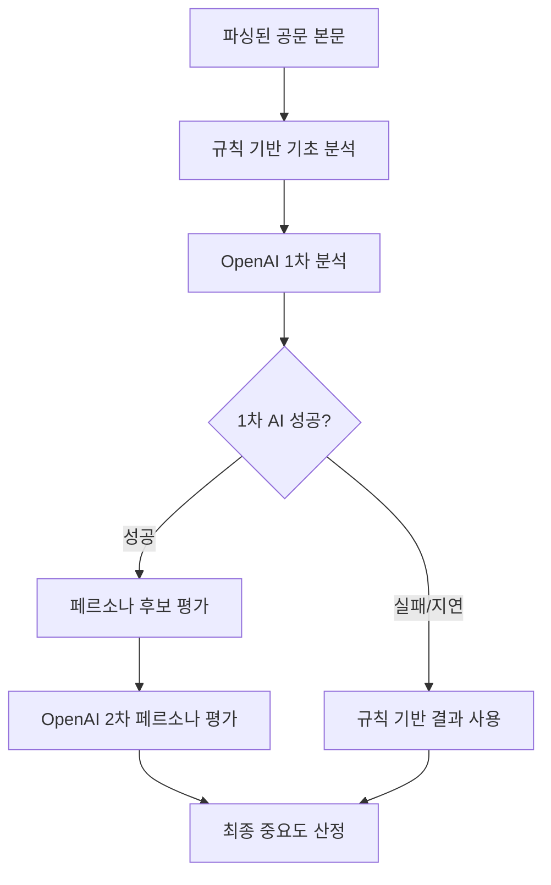
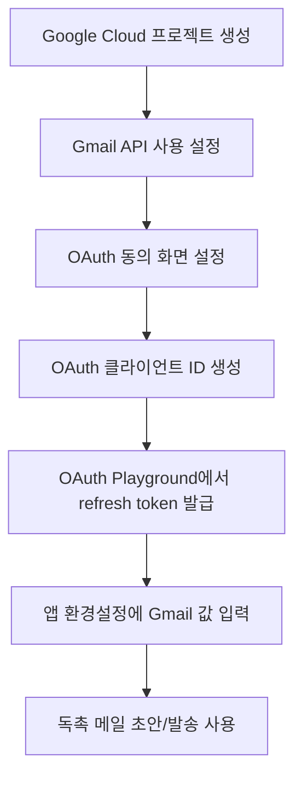
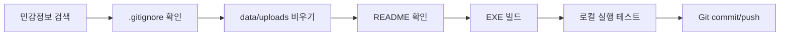

# 공문관리 AI POC

공문관리 AI POC는 공문 PDF/HWPX/HWP/DOCX/XLSX 파일을 등록하면 문서를 파싱하고, 접수 공문과 생산 공문을 구분해서 마감 일정, 취합 현황, 담당 부서, 독촉 메일 업무를 한 화면에서 관리하는 Windows용 업무 보조 프로그램입니다.

배포 대상자는 `공문관리.exe` 하나만 실행하면 됩니다. 내부적으로 로컬 서버와 KORDOC 파서 worker가 자동 실행되지만, 사용자는 서버 명령어를 직접 입력하지 않아도 됩니다. 사용자 설정값과 등록 데이터는 각 PC의 로컬 데이터 폴더에 저장되며 GitHub에는 올라가지 않습니다.

## 한눈에 보기



## 주요 기능

| 기능 | 설명 |
| --- | --- |
| 공문 파일 등록 | PDF, HWPX, HWP, DOCX, XLSX 등 공문 파일을 등록합니다. |
| KORDOC 파싱 | 파일 내용을 KORDOC 기반 파서로 읽어 제목, 본문, 기한 후보를 추출합니다. |
| 접수 공문 관리 | 내가 처리하거나 제출해야 하는 공문을 마감일 기준으로 관리합니다. |
| 생산 공문 관리 | 내가 발송한 공문에 대해 수신자별 회신 여부와 취합 현황을 관리합니다. |
| AI 1차 분석 | OpenAI가 요약, 기한, 담당부서, 필요 조치, 중요도를 판단합니다. |
| 페르소나 2차 평가 | 공무원/기관 담당자 페르소나 기준으로 업무 위험도와 영향을 재평가합니다. |
| 달력 표시 | 내가 내야 하는 공문과 내가 취합해야 하는 공문을 구분해서 보여줍니다. |
| 독촉 메일 | 미회신 담당자에게 보낼 Gmail 독촉 메일을 초안 저장하거나 발송합니다. |
| 로컬 저장 | 문서 원본, 환경변수, 업무 데이터가 GitHub에 올라가지 않도록 분리합니다. |

## 화면 구성



### 대시보드

- 등록된 공문을 접수/생산 문서로 구분해서 확인합니다.
- 공문 목록은 클릭하면 펼쳐지고, 다시 클릭하면 닫힙니다.
- 달력에는 제출해야 하는 일정과 취합해야 하는 일정이 구분되어 표시됩니다.

### 공문 등록

- `접수`로 등록하면 내가 처리해야 하는 공문으로 분석합니다.
- `생산`으로 등록하면 내가 회신을 취합해야 하는 공문으로 분석합니다.
- 생산 문서는 페르소나 위험도 평가를 하지 않고, 수신자와 회신기한 추출에 집중합니다.

### 취합 현황

- 생산 공문의 수신자 목록을 기준으로 전체 인원, 회신 완료, 미회신 상태를 관리합니다.
- 각 수신자별 완료/미완료를 처리할 수 있습니다.
- 미회신 대상자에게 독촉 메일 초안을 만들거나 바로 발송할 수 있습니다.

## 업무 흐름

### 접수 공문



### 생산 공문



### 독촉 메일



## 분석 구조



AI 호출이 느릴 경우 업무 속도를 위해 제한 시간이 적용됩니다. OpenAI 응답이 늦거나 실패하면 규칙 기반 결과로 빠르게 대체합니다.

## 성능 로그 읽는 법

업로드 시 콘솔에 다음 로그가 출력됩니다.

```text
[documents:upload:timing] parser=kordoc-api parse=1576ms build=40733ms total=42317ms
[analyze:timing] rule=220ms openai1=3657ms personaRule=31663ms openai2=5189ms total=40729ms
```

| 항목 | 의미 |
| --- | --- |
| `parse` | KORDOC가 파일을 읽는 시간입니다. |
| `build` | 문서 객체 생성, AI 분석, 페르소나 평가, 저장 준비 시간입니다. |
| `rule` | 규칙 기반 기초 분석 시간입니다. |
| `openai1` | OpenAI 1차 공문 분석 시간입니다. |
| `personaRule` | 로컬 페르소나 후보 평가 시간입니다. |
| `openai2` | OpenAI 2차 페르소나 평가 시간입니다. |
| `total` | 전체 처리 시간입니다. |

`parse`가 빠른데 `build`가 느리면 파싱 문제가 아니라 분석 단계 문제입니다. `personaRule`이 크면 로컬 페르소나 평가 최적화 대상이고, `openai1` 또는 `openai2`가 크면 OpenAI 응답 지연입니다.

## 설치 및 실행

### 일반 사용자

배포받은 파일을 실행합니다.

```text
공문관리.exe
```

실행하면 앱이 자동으로 로컬 서버를 켜고 브라우저 화면을 엽니다. 사용자는 `localhost` 주소를 직접 입력할 필요가 없습니다.

사용자 데이터 기본 저장 위치는 다음과 같습니다.

```text
%LOCALAPPDATA%\OfficialDocumentManager
```

저장 위치를 바꾸고 싶으면 실행 전에 `OFFICIAL_DOCUMENT_MANAGER_HOME` 환경변수를 지정할 수 있습니다.

### 개발자 실행

```bash
npm install
npm start
```

기본 주소:

```text
http://127.0.0.1:3000/dashboard.html
```

## 환경설정

처음 실행하면 환경설정 화면에서 API 키를 입력합니다. 입력값은 로컬 데이터 폴더에 저장되며 GitHub에는 올라가지 않습니다.

| 이름 | 필수 여부 | 설명 |
| --- | --- | --- |
| `OPENAI` | 필수 | OpenAI API 키입니다. 공문 분석과 페르소나 평가에 사용합니다. |
| `OPENAI_MODEL` | 선택 | 사용할 OpenAI 모델입니다. 기본값은 `gpt-4o-mini`입니다. |
| `GMAIL_CLIENT_ID` | Gmail 사용 시 필수 | Google Cloud OAuth 클라이언트 ID입니다. |
| `GMAIL_CLIENT_SECRET` | Gmail 사용 시 필수 | Google Cloud OAuth 클라이언트 보안 비밀번호입니다. |
| `GMAIL_REFRESH_TOKEN` | Gmail 사용 시 필수 | Gmail API용 OAuth refresh token입니다. |
| `GMAIL_FROM_EMAIL` | 선택 | 발신자 이메일 주소입니다. 비워도 Gmail 계정 기준으로 동작합니다. |
| `GMAIL_SENDER_NAME` | 선택 | 메일에 표시할 발신자 이름입니다. |
| `ADMIN_ID` | 선택 | 개발 서버 로그인 ID입니다. 기본값은 `admin`입니다. |
| `ADMIN_PASSWORD` | 선택 | 개발 서버 로그인 비밀번호입니다. EXE 환경설정 방식에서는 필수가 아닙니다. |

## Gmail 설정 흐름



Google Cloud에서 Gmail API가 꺼져 있거나 OAuth 테스트 사용자에 본인 계정이 없으면 Gmail 기능이 실패할 수 있습니다.

## EXE 다시 만들기

소스 코드를 수정한 뒤 Windows EXE를 다시 만들려면 아래 명령어를 실행합니다.

```bash
npx --yes pkg --no-bytecode --public --config package.json launcher/official-document-launcher.js --targets node18-win-x64 --output 공문관리.exe
```

`공문관리.exe`가 실행 중이면 덮어쓰기가 실패할 수 있습니다. 그럴 때는 실행 중인 앱을 종료한 뒤 다시 빌드합니다.

## 프로젝트 구조

```text
public/                     화면 파일
server.js                   Express 서버와 API 라우트
server/services/            공문 분석, KORDOC 파싱, Gmail, 런타임 설정
server/mcp/                 KORDOC/Gmail/공문 MCP 서버 코드
persona/examples/           페르소나 예시 데이터
launcher/                   Windows EXE 런처
data/                       로컬 업무 데이터 저장소, GitHub 제외
uploads/                    업로드 문서 임시 저장소, GitHub 제외
```

## 보안 및 GitHub 업로드 기준

GitHub에 올리지 않는 파일:

- `.env`, `.env.*`
- `data/`
- `upload/`, `uploads/`
- `backup/`, `backups/`
- `result/`, `results/`
- CSV, XLSX, PDF, HWP, HWPX, DOC, DOCX 같은 업무 문서
- `*.exe`
- `credentials.json`, `client_secret*.json`
- 인증서, 키 파일, 개인 토큰

예시 파일은 실제 키가 없는 `.env.example`만 사용합니다. 실제 API 키, refresh token, 공문 원본, 업로드 파일, 개인정보가 포함된 데이터는 저장소에 포함하지 않습니다.

## 배포 체크리스트



배포 전에 반드시 `data`, `uploads`, 실제 문서 파일, 실제 API 키가 Git 추적 대상에 들어가지 않았는지 확인합니다.

## 주의사항

- 이 프로젝트는 POC 용도입니다.
- EXE 안에서 로컬 서버가 자동 실행되므로, 사용자는 별도 서버 명령어를 입력하지 않아도 됩니다.
- KORDOC 파싱은 로컬 worker를 통해 실행됩니다.
- Gmail 기능을 쓰려면 Google Cloud에서 Gmail API와 OAuth 설정이 완료되어야 합니다.
- OpenAI 응답이 느리면 규칙 기반 분석으로 대체될 수 있습니다.
- 실제 운영 배포 전에는 조직 보안 정책에 맞는 계정/토큰 관리 방식을 별도로 검토해야 합니다.
